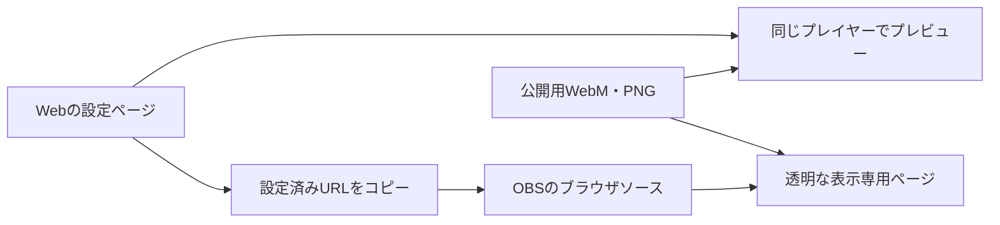

# OBS向けWeb版の設計

作成日: 2026-09-27
状態: Web版を実装済み。OBS実機検証は未実施。
調査対象: `60a6809`（Animals Desktop - for Real 0.5.0）

## 提案

既存の公式サイトに、設定ページと背景が透明な表示専用ページを追加する。
利用者が設定済みURLをOBSのブラウザソースに貼ると、配信画面に動物がときどき現れる。
デスクトップアプリの起動、アカウント登録、常駐サーバーは不要とする。

初版は既存アプリの「ときどき遊びに来る」体験をWebに移す。
同時表示は1匹、無音とし、選んだ動物・毛色・動きだけをランダムまたは順番に表示する。
設定ページを閉じてもOBS内で動作し続ける。
設定画面は通常のブラウザで開く。OBSに貼るURLは動物の表示専用とし、設定パネルやボタンは配信に映さない。

## 現状から分かったこと

| 現状 | 設計への反映 |
| --- | --- |
| `electron/overlay.html` と `overlay.js` がHTML/CSSと動画で描画している | プレイヤーをElectronのIPCから分離して再利用する |
| `electron/main.js` が動物選択・出現間隔・ウィンドウ制御を担当している | Web側に出現スケジューラーを用意し、画面領域はブラウザソースのサイズから得る |
| 7種・16毛色、種別の動き28パターン、WebM 64本 | 初版も同じ収録範囲を対象にする |
| `.github/workflows/pages.yml` が `docs/` をGitHub Pagesに公開している | 既存の公開先に `/obs/` を追加する |
| 公開用WebMは計約23.1 MiB、最大約0.9 MiB。原本は約41.1 MiBで内容が異なる | 公開用素材を候補にし、原本で一括上書きしない |
| 公開用PNGが13枚で、ウサギの3毛色が不足している | 初版に必要な代替PNGと選択用画像を追加する |
| 既存ギャラリーは再生失敗時にMP4へ切り替える | OBS用プレイヤーは透過PNGへ切り替える |

素材確認では、公開用WebM 64本すべてについて2秒地点を `libvpx-vp9` でRGBAに復号し、透明画素があることを確認した。
長さは約3.96〜4秒で、音声ストリームはなかった。
一部は `alpha_mode` メタデータが欠けていても透明画素を持つため、メタデータの有無だけで不合格にしない。
この確認は全フレームの品質やOBS上の透過再生を保証しない。OBS実機での確認は公開前に行う。

## 利用者の操作

1. 公式サイトの「OBSで使う」を開く。
2. 出したい動物と毛色にチェックを入れ、動き・出現間隔・サイズ・表示エリアをプレビューで調整する。
3. 「OBS用URLをコピー」を押す。
4. OBSでブラウザソースを追加し、URLと配信キャンバスの幅・高さを設定する。
5. 配信画面に動物が現れる。設定変更時はURLをコピーし直して貼り替える。



通常のブラウザとOBSの保存領域を共有できる前提にしない。
`localStorage` は設定ページの下書きと名前付きプリセットの保存に使い、OBSへの設定受け渡しはURLで完結させる。
プレビューの「今すぐ表示」はそのプレビューだけを操作する。
初版にはOBSを遠隔操作する接続がないため、設定画面に「OBSへ反映済み」といった表示を出さない。

## 設定画面と初版の機能

### 画面の配置

「表示する動物」「出方」「大きさと場所」「保存とOBSへの設定」の順に編集できる画面にする。
PCでは左に設定、右にプレビューを固定表示する。狭い画面では縦に並べる。
基本設定を最初から表示し、毛色別サイズなどは「詳細設定」を開いて変更できるようにする。
初期値のままでもURLをコピーできる。

```text
┌ 表示する動物 ─────────────┬ プレビュー ──────────────┐
│ 種の切替 / 全選択 / 選択解除    │ 1920×1080 / 1280×720 / 縦画面 │
│ 写真付きの毛色カード □ □ □     │ 明るい背景 / 暗い背景 / 市松模様 │
│ 選択中：3種類                 │                            │
│ 各動物の動き □ □ □ □         │    動物と表示エリアの確認       │
├ 出方・大きさ・場所 ──────────┤                            │
│ 順番 / 間隔 / サイズ / 位置     │ ［この動きを試す］［一時停止］   │
│ ［詳細設定］                 │ 選択内容・次の表示までの時間     │
├ 保存とOBSへの設定 ──────────┴────────────────────────┤
│ ［プリセット保存］［URLから設定を読み込む］［OBS用URLをコピー］   │
│ OBSにはURLの貼り替えで反映 / 幅・高さと導入手順                 │
└─────────────────────────────────────────────────────┘
```

### 表示するもの

| 設定 | 操作と仕様 | 初期値 |
| --- | --- | --- |
| 動物・毛色 | 7種で絞り込み、写真付きの16毛色カードを複数選択。種ごとの一括選択、全選択、選択解除も用意する。種の絞り込みで画面外になった選択は保持し、選択一覧で確認できる | 全16毛色 |
| 動き | 毛色ごとに対応する4動作を選択できる。各動作に名称と「試す」を付ける。同じ種への一括適用、「すべての動き」「下から顔を出すだけ」の簡単設定も用意する | 対応する全動作 |
| 表示順 | 「ランダム」「順番に表示」。順番の場合は選択一覧の並べ替えに従う | ランダム |
| 続けて同じものを出す | ランダム時に同じ毛色の連続を避ける。動きも別候補があれば連続を避ける。候補1件ならその候補を使用する | 連続を避ける |

抽選は最初に選択中の毛色を等確率で選び、次にその毛色で許可した動きを等確率で選ぶ。
動作数が多い毛色ほど出やすくなる抽選にはしない。
順番モードでは毛色一覧を一周し、各毛色の動きもカタログ順に巡回する。
未選択の動物・毛色・動作は表示対象に入れない。

例: 「チンチラのグレーとベージュだけ」「ハムスターだけ」「全動物の下から顔を出す動きだけ」「順番に1種類ずつ」を作れる。
チェック変更後は、現在のプレビューを止めて新しい設定から始める。
「この動きを試す」はその1本だけを再生し、自動再生を再開するまで別の動物を出さない。チェック状態は変更しない。

### 出方・大きさ・場所

| 設定 | 操作と仕様 | 初期値 |
| --- | --- | --- |
| 出現間隔 | 「一定間隔」「範囲内でランダム」。プリセットと秒数入力を用意。再生終了から次の読み込み開始までの時間で、ネットワーク待ち時間は別 | 60〜180秒 |
| 初回表示 | 「すぐ表示」「設定した間隔を待つ」。再表示時にも同じ方針を適用する | すぐ表示 |
| 基本サイズ | 小・標準・大・特大、詳細設定で数値指定。値は1080p時のメディア枠の高さ | 標準・240 px |
| 個別サイズ | 種別と毛色別に上書きできる。「上書きを解除」で親の設定へ戻し、「個別設定をすべて解除」で基本サイズに統一する。優先順位は毛色→種→基本サイズ。実際に適用される値と継承元を表示する | 上書きなし |
| 出現する側 | 左・右・ランダム。動きは対応する側から始める | ランダム |
| 表示エリア | プレビュー上で移動・サイズ変更できる長方形。位置と大きさの数値入力も用意し、画面下部だけ、右側の空き領域だけ等に制限できる | 画面全体 |
| 不透明度 | 20〜100%。動画と代替PNGの両方に適用する | 100% |
| 再生方法 | 「自動（動画、失敗時は画像）」「画像のみ」。画像のみでもCSSによる登場・退出を行う。動画中の細かい仕草は静止画像では再現しない | 自動 |

間隔の範囲は `1 ≤ 最短 ≤ 最長 ≤ 86400` 秒とする。一定間隔は最短と最長を同じ値にして保存する。
サイズは80〜600 pxの整数とし、プリセットは160 / 240 / 320 / 400 pxとする。
実際の描画サイズは配信画面の高さに比例させ、指定エリアに収まらないときは縦横比を保って縮小する。
個別サイズの継承ルールは既存の `electron/appearance.js` と揃える。
素材内の透明余白があるため、この数値は動物本体の身長ではない。見た目の標準サイズはOBS試作で調整する。

表示エリアは画面全体に対する百分率の `x, y, width, height` で保存する。
幅・高さは10〜100%、左上は0%以上、右辺・下辺は100%以内に制限する。
長方形の下辺を動物が立つ仮想の床、左右の辺を入口・出口として扱う。エリアの外は切り取る。
「下から顔を出す」は素材の下辺をこの床に合わせ、滑空はエリア内を横切る。
配置用の外枠と動作用の内側要素を分け、左右反転・位置指定が既存アニメーションの `transform` を上書きしないようにする。
既存の滑空などで使っている画面全体基準の `vw` / `vh` は、表示エリア基準の距離へ置き換える。
PNGでも滑空や顔出しに対応する登場・退出を持つよう、現在動画にだけ定義されている動きも補う。
エリアを狭めて縮小が発生した場合は、設定ページに実際の表示サイズを示す。

### プレビュー・保存・入力エラー

プレビューは配信用ページと同じプレイヤー・設定検証・抽選処理を使い、縮小した表示でも動物と画面の比率を保つ。
背景は明色・暗色・市松模様、解像度は1920×1080・1280×720・1080×1920から選ぶ。
背景・枠線・次回までのカウントダウン・エラー表示は設定ページだけに置く。
「今すぐ表示」「一時停止」「再開」を備え、間隔設定を変更しなくても動きを確認できるようにする。
プレビューとOBSでランダムな出現順そのものが一致することは保証せず、選択範囲・配置・サイズ・時間設定が一致することを保証する。

設定は名前を付けて同じブラウザにプリセット保存でき、読み込み・複製・名前変更・削除ができる。
作業中の設定は自動保存し、保存済みプリセットの更新は明示的な保存操作で行う。
別ブラウザや別PCでは「URLから設定を読み込む」で復元する。ログインやクラウド同期は初版に含めない。
「初期設定に戻す」は作業中の設定だけを初期化し、保存済みプリセットは残す。
ストレージへの保存やクリップボードへのコピーに失敗しても、設定編集とURLの選択・手動コピーは使えるようにする。

動物が0件、選択中の毛色に有効な動きが0件、間隔の逆転、表示エリアの範囲外などは、その項目の近くに修正方法を表示する。
入力中の不正な値を勝手に別の選択へ置き換えず、プレビューの自動再生とURL発行を止める。最後の正常設定を配信用としてコピーし続けることもしない。
種への動きの一括適用は、その種で承認済みの動作だけを対象にする。
選択解除やプリセット変更によって設定が不正になった場合も同じ検証を通す。

初版に含めないものは、複数匹の同時表示、常時表示、再生速度・素材の長さの変更、配信イベントやチャットとの連動、配信中の遠隔操作、ポモドーロとする。
デスクトップ固有のモニター選択・カーソル追従・メニューバーはWeb版では扱わない。

## URLと設定の契約

追加する予定のページ:

- `/AnimalsDesktopForReal/obs/` — 設定とプレビュー。
- `/AnimalsDesktopForReal/obs/overlay.html` — OBS表示専用。

毛色ごとの設定を扱うため、設定は1つのバージョン付きJSONとして扱う。
未公開の設計段階なので、前案の個別クエリパラメーター方式をこの方式に置き換える。
以下は未公開のURL形式例で、`<設定データ>` はJSONのUTF-8バイト列をBase64URLで表したもの。

```text
https://udteach.github.io/AnimalsDesktopForReal/obs/overlay.html#c=<設定データ>
```

復号後の設定例:

```json
{
  "version": 1,
  "variants": ["chinchilla-standard-gray", "hamster-golden"],
  "motionsByVariant": {
    "chinchilla-standard-gray": ["peek", "bottom-pop"],
    "hamster-golden": ["bottom-pop"]
  },
  "order": "random",
  "avoidRepeat": true,
  "interval": { "minSec": 60, "maxSec": 180 },
  "start": "immediate",
  "size": { "base": 240, "bySpecies": {}, "byVariant": {} },
  "side": "random",
  "area": { "x": 0, "y": 0, "width": 100, "height": 100 },
  "opacity": 100,
  "renderer": "auto"
}
```

`variants` は重複のない承認済み毛色IDの配列で、その並び順が順番モードの表示順となる。
「全選択」でも実際のIDを列挙し、将来の素材追加で既存URLから新しい動物が勝手に出ないようにする。
`motionsByVariant` は選択中の毛色すべてに空でない動作配列を持つ。動作IDは種の対応表で検証する。
`order` は `random | sequential`、`side` は `left | right | random`、`renderer` は `auto | png`、`start` は `immediate | wait` とする。
他の数値と初期値は設定表に従う。
毛色の選択順は保持し、動作配列はカタログ順に正規化する。
JSONのプロパティ順を揃えてからエンコードし、同じ設定から同じURLを生成する。
画面だけの絞り込み状態、背景色、プリセット名、言語、プレビューの停止状態は配信用設定に含めない。
Base64URLは暗号化ではないため、URLには秘密情報を入れない。

幅・高さはOBSのソース設定を正とし、URL側に重複して持たない。
設定ページで選ぶ解像度はプレビューと手順表示のために使う。
URLの解析・検証・生成を同じモジュールにまとめ、プレビューとOBS出力の差を防ぐ。

設定データのないURLは初期値で動作する。
データが指定されているのに復号できない、型や値が不正、未知のバージョンなどの場合は、OBS側では透明のまま停止する。
設定ページで該当URLを読み込んだ際に修正点を示し、利用者が選んでいない動物への置き換えを避ける。
解析前にエンコード文字列を16 KiB以下に制限する。UIで作成できる最大構成が制限内であることをテストする。
URL変更時はデータを再検証し、古い再生・待機を破棄して新しい設定から開始する。
公開後は `version: 1` の意味を維持し、形式変更時は移行処理を用意する。
設定に任意の画像URL・HTML・スクリプトは受け取らず、素材はカタログ中の同一オリジンのファイルから解決する。

## 実装の構成

既存の素のJavaScriptを維持し、Node.jsによる小さな公開用ビルドを追加する。
Webの実行時にはNode.jsを必要としない。

```text
shared/
  overlay/renderer.mjs       再生・終了・PNGへの切り替え
  overlay/motions.css        既存の動作CSS
  motions.cjs                種と動作IDの対応表
web/obs/
  index.html                 設定ページ
  overlay.html               表示専用ページ
  settings.mjs               設定UIとプレビュー
  config.mjs                 URLの解析・検証・生成
  scheduler.mjs              選択・間隔
  runtime.mjs                再生・待機・停止の状態管理
  overlay.mjs                表示ページの起動処理
  styles.css                 設定ページの見た目
scripts/build-obs-web.js     公開用ファイルとカタログを生成
docs/obs/                   生成した公開成果物
```

共通プレイヤーの入口は `createRenderer(root, { onEnded, onError })` とし、`play(spec)`・`stop()`・`destroy()` を提供する。
`window.animals` やNode.jsを直接参照せず、URL・動作・サイズ・位置を入力として受け取る。
Webの設定ページとOBS表示ページがこのプレイヤーを共用する。
Electronの `overlay.js` は既存実装を維持し、動作IDの対応表だけを `shared/motions.cjs` に共通化してパッケージ対象に加えた。
Electronのウィンドウ制御とWebのOBS表示状態制御は各環境に残す。

動物・毛色の正は `electron/catalog.js` と `research/variants.json`、動作対応の正は抽出した共通定義とする。
`main.js` と素材検査も同じ動作定義を読む。
ビルド時にブラウザ向けカタログを生成し、利用可能なWebM・PNGへの相対パスを付ける。
設定とOBS表示は同じカタログ・プレイヤー・スケジューラーを使用する。
時計と乱数はテスト時に差し替えられるようにし、実際の長時間待機なしで間隔と抽選を検証できるようにする。
QA用の固定シードや強制再生操作はテスト側から注入し、利用者向けURLには含めない。
既存ギャラリーのMP4切り替え処理はOBSに持ち込まない。

`npm run build:obs` で `web/obs/` と共通描画コードを `docs/obs/` へ出力する。
素材は原則として既存の `docs/assets/` を参照し、別ディレクトリに64本を重複配置しない。
Pagesワークフローにビルドと参照先検査を加え、起動条件に `web/`・`shared/`・カタログ・ビルドスクリプト等の入力を含める。
公開サイトと同じパス階層のローカルHTTP環境で確認してから公開する。

## 再生と復帰の仕様

基本状態は「待機 → 読み込み → 再生 → 待機」とし、非表示時は停止状態へ移る。
再生処理・出現待ち・読み込み監視・打ち切り監視は、それぞれ同時に1つまでとする。

- 選択と順序は設定に従う。ランダムかつ連続回避が有効な場合は直前と同じ毛色・動きを代替候補のある範囲で避ける。
- 動画は `muted`・`playsinline` で再生し、読み込み中は透明にする。ユーザー操作なしの再生はOBSで確認する。
- 動画の準備ができてからCSSアニメーションを開始する。4秒の素材と入口・出口の演出がずれないようにする。
- 読み込みに5秒かかった場合、再生エラー、`play()` 失敗時は同じ動物の透過PNG演出へ切り替える。
- 1回の表示処理には読み込み開始から最大12秒の打ち切りを設ける。動画・PNGの両方が失敗した場合も透明に戻し、次の間隔を待つ。
- 再生IDを付け、古い動画のイベントや遅れて返った非同期処理が次の再生を終了させないようにする。
- 終了時は動画を停止して `src` を外す。全64本の先読みや全PNGの原寸読み込みは行わない。選択UIには軽量なサムネイルを用意する。
- OBSの非表示通知で動画とタイマーを止める。再表示時は `start` の指定に従い、新しい表示サイクルを始める。順番モードは一覧の先頭に戻る。非表示中の回数は蓄積しない。
- 通常のブラウザではPage Visibility、OBSではOBS固有の可視状態通知を優先する。スタジオモードのプレビューと本番の切り替えも実機確認する。

OBSは表示状態のイベントを提供しているため、`obsSourceVisibleChanged` を利用する。
配信開始・停止やシーン切り替えを操作する権限は不要とする。[OBSの公式JS API](https://github.com/obsproject/obs-browser/blob/master/README.md)

## OBSの案内値

| 設定 | 案内する値 |
| --- | --- |
| ローカルファイル | オフ |
| URL | 設定ページからコピーしたURL |
| 幅・高さ | 配信キャンバスと同じ。例: 1920×1080 |
| FPS | 初期案は30。実機で動きと負荷を確認する |
| 表示されていないときにソースをシャットダウン | オンを推奨 |
| シーンがアクティブになったときにブラウザを更新 | オフを推奨 |

この推奨では、シーンへ戻るたびにページを読み直し、`start: "immediate"` なら準備後に1回現れる。
シャットダウンをオフにして使う場合も、可視状態イベントで停止・復帰する。
ページ自身にも透明背景を指定するため、利用者によるクロマキーや追加CSSは不要にする。
これらのブラウザソース設定はOBSの公式仕様で確認できる。[OBS Browser Source](https://obsproject.com/kb/browser-source)

## QA計画

以下は実装時に立てた検証計画であり、表中の項目がすべて合格済みという意味ではない。今回の実測結果は `qa/obs-web/results.md` に記録する。
自動テストで設定の意味と境界値を検証し、ブラウザで操作を通し、実際のOBS録画で透過描画と運用を確認する。
通常のブラウザで動いたことをOBSでの合格の代わりにしない。

### 実施する環境

| 対象 | 確認範囲 |
| --- | --- |
| 自動テスト | Node.jsで設定検証・URL・サイズ継承・抽選・時間制御を検証する |
| 設定ページ | WindowsのChrome / Edge、macOSのChrome / Safari。日本語・English、PC幅と390 px幅、キーボード操作を確認する |
| OBS | macOS・Windowsで、その時点の安定版の正確なバージョン、OS、CPU/GPU、ハードウェアアクセラレーション設定を記録する |
| キャンバス | 1920×1080、1280×720、1080×1920。OBSソースの寸法は各キャンバスに合わせる |
| 配信背景 | 白、暗色、市松模様、ゲーム画面を想定した明暗のある背景 |
| ライフサイクル | ソースのシャットダウンON / OFF、表示ON / OFF、シーン切り替え、スタジオモード、ページ更新、OBS再起動 |

Linuxは初版の実機検証対象に含めず、動作確認済みと表示しない。
Safariの動画透過が使えない環境ではPNG表示への切り替えと、その案内までを合格条件とする。
利用できないOS環境がある場合はその行を未実施のまま残し、対応を検証済みとして公開しない。

### 設定ごとのQA

| ID | 操作・入力 | 合格条件 | 方法 |
| --- | --- | --- | --- |
| C01 | 1毛色、同じ種の複数毛色、異なる種、全16毛色を選択。種の絞り込みを切り替える | 選択が保持され、抽選候補が選んだ毛色だけになる。絞り込みで隠れた選択も確認できる | 自動＋画面操作 |
| C02 | 各毛色で1動作・複数動作・全動作を選択し、種別に一括適用する | 許可した動作だけが再生され、未対応の動作を選べない。「試す」が指定の1本だけを再生し、選択は変えない | 全64組の自動列挙＋画面操作 |
| C03 | 選択0件、動作0件、最後の候補の解除 | 自動再生とURL発行が止まり、該当項目に理由が出る。全種類へ勝手に戻らない | 自動＋画面操作 |
| C04 | 1候補・2候補・16候補でランダムと順番を使用。連続回避を切り替える | 1候補でも停止しない。2候補の連続回避は交互。順番は並べ替えを反映する。動作数で毛色の抽選確率が変わらない | 注入した乱数・カウンターで自動検証 |
| C05 | 間隔1秒、60秒固定、60〜180秒、86400秒、0、逆転、小数、空欄を入力 | 正常値は終了後の待機として適用。不正値はUIで拒否。24時間設定も仮想時計で境界を確認する | 仮想時計＋画面操作 |
| C06 | 基本・種・毛色のサイズを順に設定し、上書きを解除。80 / 600 pxも指定 | 毛色→種→基本の優先順位になる。継承元の表示が正しく、解除しても別の設定を消さない | 自動＋代表素材の目視 |
| C07 | 左右、ランダム、表示エリアの移動・縮小・数値入力を組み合わせる | プレビューとOBSで位置・大きさの比率が一致。エリア外に描画せず、滑空・顔出しの出口が不自然に残らない | ブラウザ＋OBS録画 |
| C08 | 不透明度20 / 100%、動画／画像のみを切り替える | 動画とPNGで同じ不透明度になる。画像のみでは動画を読み込まない。どの設定でも音声が出ない | 通信検査＋OBS録画 |
| C09 | プリセット保存・複製・変更・名前変更・削除・初期化・ページ再読み込み | 保存済み設定と下書きを区別でき、初期化が他の保存済み設定を消さない | ブラウザ操作 |
| C10 | 別ブラウザでURLを読み込み、再コピー。全毛色・個別動作・個別サイズを最大まで設定 | 設定が同一に戻り、正規化したJSONと再発行URLが一致する。16 KiB制限内に収まる | 往復変換の自動テスト＋画面操作 |
| C11 | 壊れたBase64URL、壊れたJSON、未知のID・版・動作、範囲外値、超過サイズを入力 | OBSは透明で停止。設定ページはエラーを示し、任意のURLやスクリプトを実行しない | 自動＋ブラウザ操作 |
| C12 | コピー権限を拒否、保存領域を使用不可にする。日本語・English、狭い幅、キーボードで操作 | 手動コピーで導入できる。保存失敗を示して編集を続けられる。ラベル・選択状態・エラーが読め、全操作に到達できる | ブラウザ操作 |

自動抽選テストでは1,000回の選択が許可集合内であることを固定シードで確認する。
等確率の検証は乱数区間と候補への対応を決定的に検査し、偶然の回数差によって落ちるテストにはしない。
設定の全組み合わせを総当たりせず、全16毛色×対応4動作は網羅し、位置・サイズ・エリア・再生方法は組み合わせの各ペアと境界値を覆う。
最も狭いエリア＋最大サイズ＋滑空、毛色1件＋動作1件＋最短間隔など、衝突しやすい組み合わせは個別に追加する。

### 素材・OBS運用・異常時のQA

| ID | 確認内容 | 合格条件・残す証跡 |
| --- | --- | --- |
| R01 | 全64動画と全16代替PNG、選択用サムネイル、生成カタログの参照先を検査する | ファイル欠落・不正な参照・音声がない。動画の複数時刻をRGBAで復号し、透過を確認する。結果一覧を残す |
| R02 | 全64動画を開始から終了までOBSで録画。白・暗色背景で確認し、0 / 0.5 / 1 / 2 / 3 / 約3.9秒を切り出す | 黒い矩形、白い動物の欠け、輪郭の色かぶり、足の浮き、端の残像がない。素材IDと時刻が分かる録画・静止画を残す。透明画素があるだけで見た目を合格にしない |
| R03 | 公開成果物のURLから、初回表示、PNG切り替え、設定ページを閉じた状態で動作させる | 指定された動物だけが再生される。設定UI・読み込み表示・エラー文が配信画面に映らない。初期表示の録画を残す |
| R04 | シーン切り替え・表示切り替えを各20回。シャットダウンON / OFF、初回待機あり／なしで確認する | 再生やタイマーが重複せず、復帰方針と順番のリセットが仕様通り。古いロード完了通知で突然別の動物を出さない |
| R05 | スタジオモードでプレビューと本番を10回切り替える。同じソースの参照と、別々に作ったソースを確認する | 同じソースへの通知でスケジューラーが二重化しない。別ソースは独立した設定で動作する。実際にどのタイミングで再開したかを記録する |
| R06 | 動画404、低速回線、ネットワーク切断、`play()` 拒否、途中の読み込み停止、PNG404を発生させる | 読み込み5秒でPNGへ切り替わり、1回の処理は最大12秒で終了する。両方失敗しても次の間隔へ進み、復旧後に自動再生できる。通信を無限に再試行しない |
| R07 | 待機中・読み込み中・再生中にURLを変更し、ページ更新とOBS再起動も行う | 新URLの設定に切り替わり、以前の再生・タイマー・イベントが残らない。ページ更新後もURLから設定が戻る |
| R08 | 待機主体30分、その後1〜5秒間隔で全動物を2時間動作させる。両OSで実施する | 時間とともにDOM・イベント購読・タイマーが蓄積しない。ソース当たり再生動画1本以下、出現待ちタイマー1つ以下、打ち切り監視1つ以下。OBS録画と資源使用の時系列を残す |
| R09 | 同じ録画設定で、ソースなし／待機中／再生中のCPU・GPU・メモリ・OBS描画遅延を比較する | 基準の機材と解像度を記録し、待機中の継続デコードや全素材先読みがない。試作で決めた性能目標内に収まる。目標は最初の試作で数値を決め、公開前に固定する |
| R10 | Electronの左端登場・顔出し・滑空、サイズ継承、複数モニター、PNG切り替えを再確認する | 共通プレイヤー抽出前の主要動作が維持され、`npm run check` が通る |

R08では開始後10分をウォームアップとし、その後10分ごとにメモリと要素・タイマー数を記録する。
メモリが持続的に増える場合は、繰り返し後に解放されない動画・イベント・キャッシュを調べ、原因不明のまま合格としない。
R09のCPU/GPU値は機材依存なので、未測定の数値を保証として書かない。
ただし素材全件先読み、停止中の継続デコード、再生終了ごとの資源の増加は、性能目標の決定前でも修正対象とする。

### 証跡と公開判断

実装時に `qa/obs-web/` に、設定JSON、テストID、実施日時、コミット、OS・ブラウザ・OBSの版、結果、再現手順をまとめる。
録画は配信出力を保存し、設定ページのスクリーンショットだけを透過表示の証拠にしない。
重い録画ファイルをGitへ無条件に追加せず、結果一覧から保存先を参照できるようにする。
結果は「合格／不合格／未実施」を区別し、再現できた問題は設定JSONと録画時刻を添える。

初版公開の条件は、C01〜C12、R01〜R10が宣言した対応環境で合格し、設定取り違え・透過破綻・再生の永久停止・増え続ける資源使用が残っていないこと。
性能目標が未決定、OBS実機検証が未実施、素材や環境の一部が未確認の場合は、その範囲を合格として扱わない。
軽微な表示上の問題を残す場合も、影響と回避方法を結果一覧に記録する。

## 実装順

1. **OBSでの小さな試作。** 左端からの登場・下からの登場・滑空を代表する3本を透過表示する。サイズ・接地・自動再生・シーン復帰をmacOS / Windowsで確認する。ここでメディア方式を確定し、基準機材でのCPU/GPU・メモリ・描画遅延の数値目標をQA記録へ追記する。
2. **再生基盤と素材。** プレイヤーを共通化し、URL設定・スケジューラー・OBS可視状態を実装する。ウサギPNGを補い、64本の公開素材の明暗背景での見え方を確認する。
3. **設定ページ。** 毛色・動作の選択、出方、個別サイズ、表示エリア、プリセット保存、共通プレイヤーでのプレビュー、URLコピー、導入手順を作る。
4. **QAと公開準備。** 上記の検証を実施し、結果と未解決項目を記録する。公式サイトに導線とPagesビルドを追加し、生成した成果物からOBS導入を通して確認する。

公開前に残る主な不確実性はOBSの各環境でのVP9透過描画とGPU負荷である。
SafariなどOBS以外のプレビューで透過が維持できない場合はPNG表示に切り替え、その状態を設定ページに示す。
WebMの再生可否だけで透過対応を判定しない。

配信中の操作が必要になった段階で、別の操作画面とOBSを結ぶ通信経路を追加する。
この機能にはOBS WebSocketや中継サーバー等の選定が必要なので、静的ページで完結する初版とは別に設計する。
